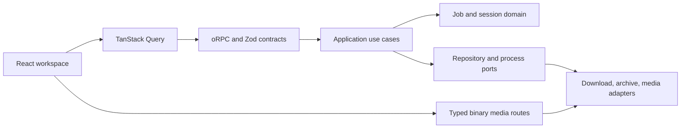

# ZIP Image Viewer architecture

## Runtime model

ZIP Image Viewer is a trusted, self-hosted media workspace. Jobs and extracted
sessions are deliberately ephemeral: restarting the server clears application
state, while temporary files are removed by the session cleanup policy.

The server accepts at most 50 URLs in one batch and runs no more than two
downloads and two FFmpeg processes concurrently. The browser can keep browsing
ready sessions while other jobs continue in the background.

## Boundaries

- `shared/` owns transport-neutral schemas and inferred public types.
- `server/domain/` owns state transitions and invariants without HTTP or file
  system dependencies.
- `server/application/` coordinates domain operations through typed ports.
- `server/infrastructure/` implements file, process, download, and in-memory
  repository adapters.
- `server/http/` and the route handlers adapt Express requests to application
  inputs. Binary file and streaming responses remain typed Express routes.
- `client/src/features/` owns workspace features. Shared primitives and tokens
  do not import feature or page modules.

Fallow checks these dependencies so an inner layer cannot acquire an accidental
dependency on an outer delivery layer.

## Type-safety policy

Input is `unknown` until a Zod schema validates it. Contracts are the source of
truth for requests, responses, job events, and errors; consumers infer types
from those schemas. Source and test code must not use explicit `any`,
`@ts-nocheck`, unsafe double assertions, or unvalidated JSON casts.

## Streaming

Compatible video is remuxed and incompatible video is transcoded into a lazy
four-second HLS ladder. A master playlist advertises aligned variants and lets
HLS.js select quality automatically using measured bandwidth and player size.
Manual quality selection remains available and does not reset playback time.

## Quality gates

Pull requests run formatting, ESLint, strict TypeScript, Vitest coverage,
Fallow, a production build, and Chromium Playwright tests. The default branch
and scheduled workflow add Firefox and WebKit. Local Lefthook checks staged
format/lint on commit and the wider typed/test/Fallow gates before push.
